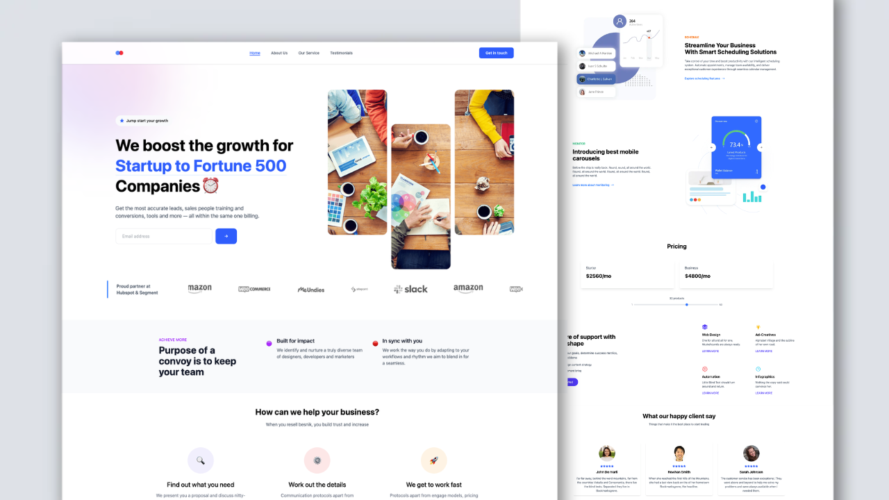

Modern Business Landing Page

 
A sleek and responsive landing page built with React, Tailwind CSS, and smooth Framer Motion animations.

🌟 Features
✅ Modern, clean design
✅ Fully responsive layout for all devices
✅ Smooth, professional animations with Framer Motion
✅ Interactive UI components
✅ Testimonials carousel using Swiper.js
✅ Newsletter subscription form
✅ Company logo showcase section
✅ Dynamic pricing calculator
✅ Service showcase sections

🛠️ Built With
React.js

Tailwind CSS

Framer Motion

Swiper.js

React Icons

🚀 Getting Started
Prerequisites
Node.js (v14 or higher)

npm or yarn

Installation
Clone the repository

bash
Copy code
git clone https://github.com/mdalmamunit427/modern-business-landing-page-react-tailwindcss
cd modern-business-landing-page-react-tailwindcss
Install dependencies

bash
Copy code
npm install
Start the development server

bash
Copy code
npm run dev
📦 Project Structure
css
Copy code
src/
 ├── components/
 │   ├── Navbar.jsx
 │   ├── Hero.jsx
 │   ├── CompanyLogo.jsx
 │   ├── PurposeSection.jsx
 │   ├── FeaturesSection.jsx
 │   ├── ScheduleSection.jsx
 │   ├── MonitorSection.jsx
 │   ├── PricingSection.jsx
 │   ├── ServicesSection.jsx
 │   ├── TestimonialsSection.jsx
 │   ├── NewsletterSection.jsx
 │   └── Footer.jsx
🎨 Customization
Replace placeholder images and text with your own branding and content.

Update the company logo and testimonials in the data.js file.

Modify pricing plans in PricingSection.jsx.

Customize the newsletter form in NewsletterSection.jsx.

✨ Personal Note
This was my first project using React combined with Tailwind CSS. Building this landing page gave me valuable hands-on experience in integrating a component-based framework with a utility-first CSS framework to create a modern, responsive, and dynamic web application. It helped me understand how to structure React components, apply Tailwind styles effectively, and enhance user experience with Framer Motion animations.

📝 License
This project is licensed under the MIT License. See the LICENSE file for more details.

If you’d like, I can help you export this as a README.md with the correct relative path for the image. Just let me know!

